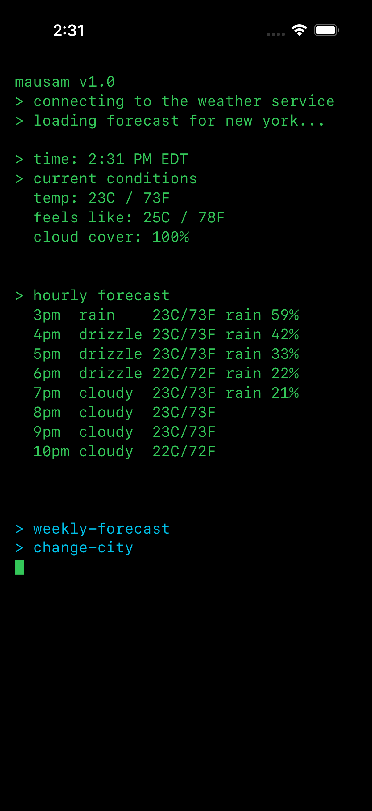
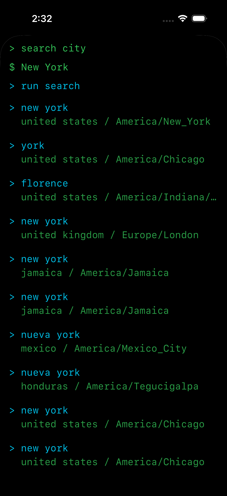
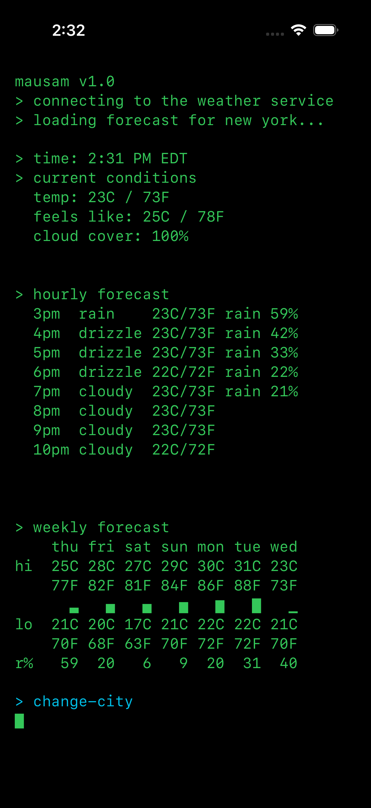

### mausam: the terrible weather app
This app does not at any point request your phone's location. You can set a city as the location you wanna track for weather, but even that info is only stored on your phone. Well, it is terrible because it does not take your live location, so it won't actually update the weather based on your location. Frictionmaxxing?? Oui. Oui.

Also, it will notify you if it's gonna rain or snow around you. Maybe. If it wants to. Remember when I said this app was kinda terrible?

## Screenshots & Recording

### App Recording

### Landing Screen

### Search Screen

### Search Results

### Weekly Forecast

